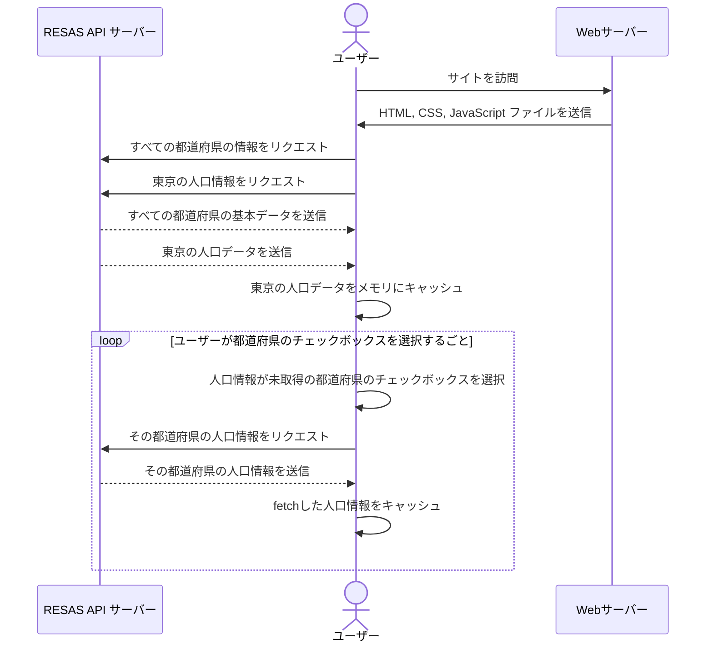

# What's this?

都道府県ごとの人口推移グラフを表示するサービスです。
データは RESAS API から取得しています。

# 仕様

## フロー

### サイトアクセス時

```
RESAS APIから都道府県の基本データを取得;
RESAS APIから都道府県の人口のデータを取得;
データをContextに保存;
グラフがContextからデータを取得し、表示;
```



### グラフコントロール時

#### 都道府県選択

```
Controllerからグラフに表示する都道府県をチェック;
(チェックした途端にグラフが変化)
```

#### グラフの種類の変更

```
「総人口」「年少人口」「生産年齢人口」「老年人口」からなるラジオボタンをチェック;
(チェックした途端にグラフが変化し、グラフの種類の状態をチェックしたラジオボタンの値にセット)
```

## 状態

1. グラフの種類:

- "Total"
- "Young"
- "WorkingAge"
- "Elderly"

2. API から取得したデータを加工したもの

```
[
  {
    "prefCode": 1,
    "prefName": "北海道",
    "boundaryYear": 2020,
    "data": [
      {
        "label": "総人口",
        "data": [
          {
            "year": 1980,
            "value": 〇〇,
          },
          {
            "year": 1985,
            "value": △△
          },
          ...
        ],
      }
      {
        "label": "年少人口",
        "data": [
          {
            "year": 1980,
            "value": □□,
          },
          {
            "year": 1985,
            "value": xx
          },
          ...
        ],
      }
    ] | null
  },
  {
    "prefCode": 2,
    "prefName": "青森件",
    "boundaryYear": 2020,
    "data": [
      {
        "label": "総人口",
        "data": [
          {
            "year": 1980,
            "value": 〇〇,
          },
          {
            "year": 1985,
            "value": △△
          },
          ...
        ],
      }
      {
        "label": "年少人口",
        "data": [
          {
            "year": 1980,
            "value": □□,
          },
          {
            "year": 1985,
            "value": xx
          },
          ...
        ],
      }
    ] | null
  }
]
```

# 工夫したところ

1. データフェッチを必要最小限の程度に留めること
1. レスポンスが早い UI
1. レスポンシブな UI
1. コンポーネント構造
1. 整備された開発環境
1. 状態管理
1. API のデータ構造に大きく依存しない設計

1 について、一度データをフェッチした都道府県は何度チェックのオンオフをしようとも、再度データをフェッチすることはありません。
これによりデータをフェッチするのは初めてその県にチェックをつけたときだけです。
初回目以降は表示が切り替わるだけにし、余計な通信をしないような設計にしました。

2 について、チェックボタンを押した後の通信中はローディング中であることを表示することにより、ユーザーがストレスを抱えないようにしています。

3 について、ハンバーガーメニューによるナビゲーションやサイドバーを実装し、レスポンシブな UI を実現しています。

4 について、機能駆動ディレクトリ構造を採用しました。

5 について、ESLint, Prettier, StyleLint,そして Lint Staged を使用することでコード品質を高める開発環境を整えました。

6 について、小規模アプリケーションのため Redux のような Flux アーキテクチャではなく Context API のような簡潔な状態管理ライブラリを使用しました。

7 について、今回のデータ構造はすべての県が 1960 年、1965 年、... 、2045 年までの 5 年区切りのデータ構造となっていましたが、それを前提とせず、与えられたデータに合わせ横軸が変化するようにしました。
さらに県ごとのデータの年代の範囲が異なっていても、自然なグラフになるようにしました。
例えば次のようなデータの年代が取りうる値の範囲が異なっていたとしても、自然なグラフになります。

```
[
	{
		boundaryYear: 2020,
		prefCode: 1,
		prefName: '北海道',
		data: [
			{
				label: '総人口',
				data: [
					{
						year: 1985,
						value: 100,
					},
					{
						year: 1990,
						value: 120,
					},
					{
						year: 1995,
						value: 130,
					},
				],
			},
		],
	},
	{
		boundaryYear: 2020,
		prefCode: 2,
		prefName: '青森県',
		data: [
			{
				label: '総人口',
				data: [
					{
						year: 1990,
						value: 50,
					},
					{
						year: 1995,
						value: 60,
					},
					{
						year: 2000,
						value: 80,
					},
				],
			},
		],
	},
];


```

# メタ情報

## 要した時間

約 4 日

## 総合的なプログラミング歴

2 年

## これまでの WB フロントエンドプログラミング歴

1 年半

詳細：

- 0 ヶ月 ~ 6 ヶ月：Vanilla JavaScript
- 7 ヶ月 ~ 18 ヶ月：React

## 着手にあたり参考にしたページや書籍、リポジトリがあれば

- https://zenn.dev/takepepe/articles/nextjs-testing-strategy-2022
- https://github.com/takefumi-yoshii/nextjs-testing-strategy-2022
- https://profy.dev/article/react-folder-structure
- https://react.dev/learn
- https://qiita.com/akym03/items/7e4db720a9e1bfad7747
- https://dev.to/eiel/createcontext-provider-it-s-better-not-to-use-provider-and-use-createcontext-in-same-file-19he

## AI を利用した場合成果があれば簡潔なレポート

都道府県ごとの同じ年の人口データを 1 つのオブジェクトにまとめる関数を ChartGPT に書いてもらいました

```
例
// from
[
  {
    prefName: "北海道",
    data: [{
      year: 1990,
      value: 1_000_000
    }, {
      year:1995,
      value: 1_200_000
    }, ... ]
  },
  {
    prefName: "青森",
    data: [{
      year: 1990,
      value: 500_000
    }, {
      year:1995,
      value: 700_000
    }, ... ]
  },
]

// to
[
  {
    year: 1990,
    北海道: 1_000_000,
    青森: 500_000,
  },
  {
    year: 1995,
    北海道: 1_200_000,
    青森: 700_000
  },
  ...
]
```
